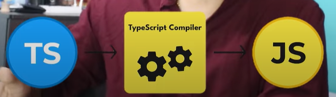

## TypeScript
    It's a superset of JavaScript that adds static typing and other features to enhance JavaScript development.
    TYPESCRIPT = JAVASCRIPT + enhancement
<<<<<<< HEAD

    TypeScript makes our code easier to read, write and maintain

    TypeScript catches errors at compile time instead of runtime, which makes debugging easier and reduces the likelihood of bugs in production 

    A browser wont support TypeScript, we have to transcribe the code into js in order for the browser to understand.
    
=======
    
>>>>>>> b2bb0bc88827881b71e102d2f67dc5b607a46502
# used in : 
 1) Angular a modern framework is built entirely in TypeScript.
 2) Vue is written in TypeScript.
 3) Few developers use TypeScript in React.
 4) Next.js uses TypeScript.
 5) React Native is making use of TypeScript.
